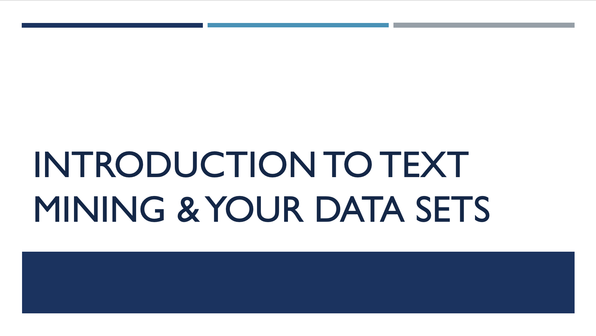

# Module 1: Introduction to Text Mining and Datasets

## Summary
### What is text mining? 

To begin with, here are some general definitions and important points related to text analysis to help you navigate the next three modules.

Text analysis: A form of data mining, using computer-aided methods to study textual data.
Distant reading: As compared to close reading, which finds meaning in word-by-word careful reading and analysis of a single work (or a group of works), distant reading takes large amounts of literature and understands them quantitatively via features of the text. (Conceptualized by Franco Moretti)
Non-consumptive research: Research in which computational analysis is performed on text, but not research in which a researcher reads or displays substantial portions of the text to understand the expressive content presented within it.
Algorithm: A process a computer follows to solve a problem, creating an output from a provided input.
Text corpus/corpora: A “corpus” of text can refer to both a digital collection and an individual's research text dataset. Text corpora, the plural form, are bodies of textual data.
Dataset: In the context of this class, a dataset is a collection of content created by users.
Volume: Generally, a digitized book, periodical, or government document.
Optical character recognition (OCR): Mechanical or electronic conversion of images of typed, handwritten or printed text into machine-encoded text. The quality of the results of OCR can vary greatly, and raw, uncorrected OCR is often described as “dirty”, while corrected OCR is referred to as “clean”. 

Find more Digital Humanities terms and their definitions [here](https://folgerpedia.folger.edu/Glossary_of_digital_humanities_terms)

### Finding and gathering text

Text can be approached as data and analyzed by corpus/corpora.
Before analyzing textual data, it is important to ensure the text is of sufficient quality (e.g., OCR-ed data is cleaned up) and fully prepared (certain unnecessary elements are discarded).

Finding text suitable for computational analysis is challenging, especially with issues of copyright and licensing restrictions, format limitations, and hard-to-navigate systems.

Three commonly used sources to find textual data are vendor databases, digital collections, and social media. Each source has its own strengths and challenges when it comes to downloading text. For this class you will be have the choice of several open datasets, and one additional dataset from Gale Primary Sources.

### Factors that affect choice of textual data 

- How much flexibility is needed for working with the data?
- What is the the technical skillset of the researcher?
- Are there  funding limitations?

## Module Objectives 
- Learn about the nature of text mining in the humanities and the types of research being carried out.
- Learn about the datasets you will be using, and make a choice as to which you will work with in class.

## Module Video

[View video](https://youtu.be/fM7vUXf-svM)

## Module Slides
[Download as a PDF](data/2021_ER&Lworkshop_Module1.pdf)

## Module Milestone
- Choose a dataset from the list we have provided on the [Data](data) page to get started.

 
**Finished?** Navigate to [Module 2](module-2), to learn about digital literacies and critical thinking skills. 