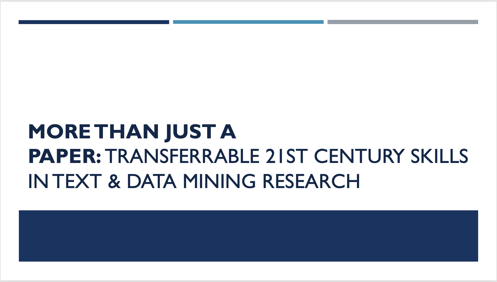

 
# Module 2: Digital Literacies and Critical Thinking Skills

## Summary
In Module 2, we will discuss the role of digital literacy, critical thinking, and project management in text and data mining research. Through a project-based learning lens, we will situate text and data mining to identify and practice key critical thinking strategies that can help facilitate the inquiry and research workflow.

## Module Objectives 
- Identify critical thinking, digital literacy, and project management outcomes associated with text and data mining.
- Apply critical thinking strategies to think about ideation and interpretation of research questions and workflow output.

## Module Video

[View video](https://youtu.be/adbEuA9TLWI)

## Module Slides
[Download as a PDF](data/2021_ER&Lworkshop_Module2.pdf)

## Module Milesones
 - Create a concept map for your topic. Be sure to branch out at least three layers. 
 - Select a concept on your outer most layer and perform some preliminary research to determine if the level of specificity of this area is actionable for research.   
 - Then, do the 'Who, Why, How, When' activity to develop your research question using that preliminary research and reflection. 
 - Evaluate your research question and write down what you anticipate will be needed for cleaning, tools, and close reading to plan and scope your project effectively. 

 
 
**Finished?** Navigate to [Module 3](module-3), to learn how to clean your OCR text with Lexos. 