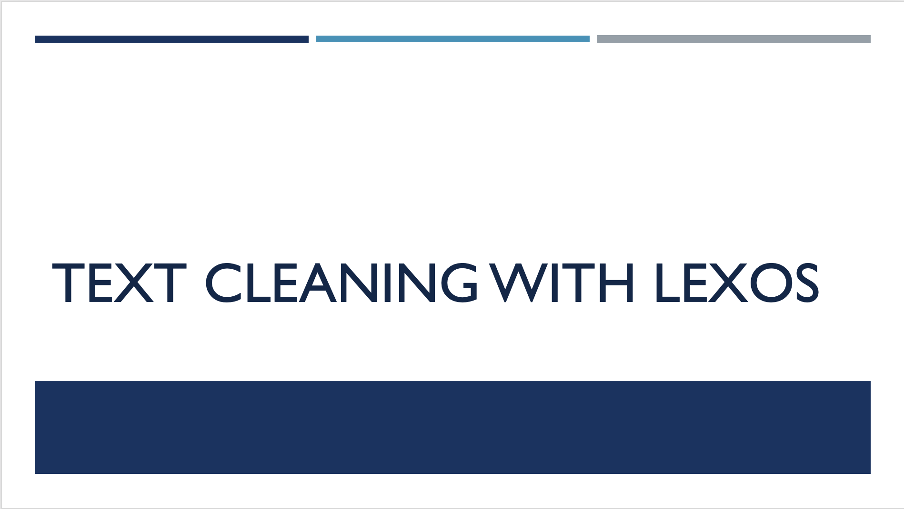

# Module 3: Text Cleaning with Lexos

## Summary 
In Module 3, we will discuss common issues associated with digitizing and OCR-ing historical texts and how to remedy them. We will review sample use cases and potential solutions to these common issues. The session will conclude with application of one of these solutions using an open-source application named Lexos.

## Module Objectives 
- Identify common issues with OCR'd historical text
- Diagnose and remedy issues with OCR text

## Module Video

[View video](https://youtu.be/ungH1ryAiwk)

## Module Slides
[Download as a PDF](data/2021_ER&Lworkshop_Module3.pdf)

From the Wheaton College Lexomics Department Website: 

>Lexos is a web-based tool to help you explore your favorite corpus of digitized texts. Our primary motivation is to help you find the explorer spirit as you apply computational and statistical probes to your favorite collection of texts. Lexos provides a workflow of effective practices so you are mindful of the many decisions made in your experimental methods.

**Stretch Goal Instructions** 

1. Download and unzip the folder with your chosen data set, from a selection in the Preparation page. 

2. Review the documents and consider any issues with the text. Consider how you would address those issues to get the best result. 

3. Open up the Lexos tool using [this link](http://lexos.wheatoncollege.edu/upload) 

4. Upload your data set by clicking the “Browse” button and selecting the files in your folder. You can also drag and drop the individual files into the “Drag files here” container. Successful uploads will appear in the “Upload List.”  

5. Once your files have been uploaded, click the “Prepare” link in the upper right hand corner and click the “Scrub” option in the drop down list. 

6. Take a moment to experiment with the options on the page. 

7. Use the Previews section and click the “Preview” button to review your changes and see the impact on the text. 

Here are steps you can follow to use the **Stop/Keep Words** option 

Download the English_StopWord_List.txt.file from the [Data](data.md) page. 

1. Paste the words in the English_StopWord_List.txt file in the text box 

2. Click the “Stop” option 

3. Navigate to the “Previews” section on the page and click “Preview” button to see the changes to your text files. 

Tweak the English_Stop_Words.txt file and repeat the steps above until you’re happy with your results.  

4. Once you feel the text is in a good state, click the “Apply” button. 

Now navigate to **“Visualize”** and select the Word Cloud option 

Examine the terms in the word cloud 

Navigate to the Scrub page again and download your cleaned data set by clicking the “Download” button in the upper right hand corner of the “Preview” section.

## Module Milestones

- Complete the text cleaning activities until you are happy with the OCR text, and feel that it is ready to take forward to analysis.

 
**Finished?** Navigate to [Module 4](module-4.md), to learn how to use Voyant to visualize your data set. 